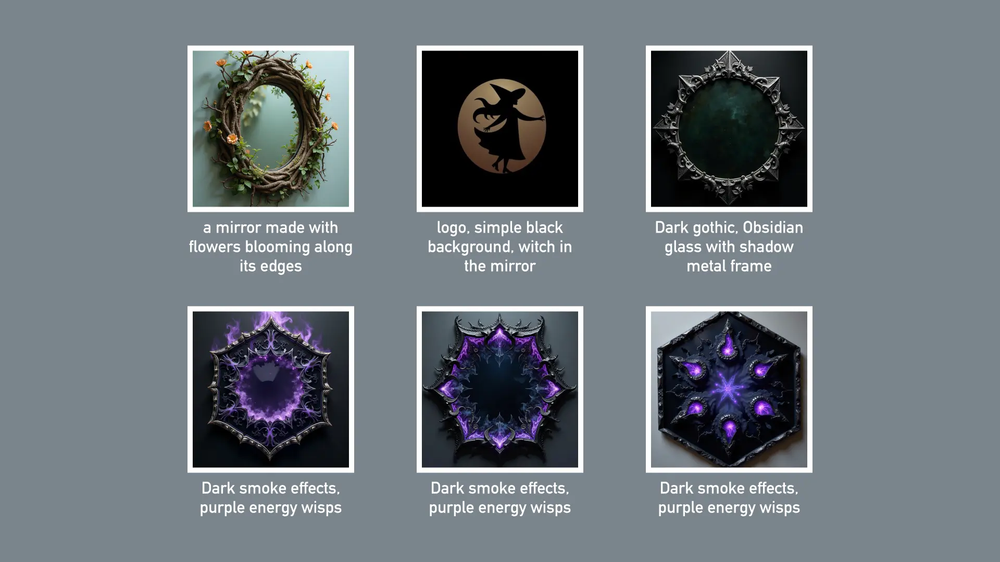

# MagicMirror

Instant AI Face Swap, Hairstyles & Outfits — One click to a brand new you!

  

## Features

- **Where AI Meets Your Beauty**: Effortlessly try on new faces, hairstyles, and outfits
- **Stupid Simple**: Drag and drop photos to instantly change faces - no complex settings required
- **Hardware Friendly**: Runs smoothly on standard computers, no dedicated GPU hardware required
- **Privacy First**: Completely offline processing - your images never leave your device
- **Ultra-Lightweight**: Tiny footprint with <10MB installer and <1GB model files

## Installation

> [👉 中文教程请戳这里](./README.zh-CN.md)

MagicMirror currently supports macOS and Windows:

1. [Download](https://github.com/idootop/MagicMirror/releases/tag/app-v1.0.0)
2. [Usage Guide](https://thread-sphynx-f26.notion.site/MagicMirror-User-Guide-147aea89ebf680c189cdd76f5668261a)

If you have any questions or need assistance, please [submit an issue](https://github.com/idootop/MagicMirror/issues) or join our [Discord server](https://discord.gg/87RuMC5smy).

## Motivation

Ever found yourself endlessly scrolling through hairstyles and outfits, wondering "How would this look on me?" As someone who loves exploring different styles but hates the hassle, I dreamed of an app that could instantly show me wearing any look I fancy.

While AI technology has advanced tremendously, most AI face applications either require complex setup, demand high-end GPU hardware, or rely on cloud processing that compromises privacy.

**The ideal solution should be as simple as taking a selfie** - just drag, drop, and transform. No technical expertise needed, no expensive hardware required, and no privacy concerns.

So, why not build one myself?

And that’s how MagicMirror came to life ✨

Enjoy! ;)

## One More Thing

Every design element in MagicMirror - from the logo and typography to the UI - was created using AI ✨

I used [Tensor.ART](https://tusiart.com/), a free AI image generation platform. It offers access to the latest models like Flux and SD 3.5, plus the ability to train your own custom models. For example, I created MagicMirror's logo by training a Flux-based model on reference images collected from Dribbble - quick and simple.

Compared to platforms like [Civitai](https://civitai.com/) and [LibLib.AI](https://www.liblib.art/), [Tensor.ART](https://tusiart.com/) has more models at a lower price, making it the most cost-effective option. If you're looking to try AI image generation or want a more affordable platform, I recommend giving [Tensor.ART](https://tusiart.com/) a try.

## Acknowledgments

MagicMirror builds upon several outstanding open-source projects:

- [Tauri](https://github.com/tauri-apps/tauri): Build smaller, faster, and more secure desktop and mobile applications with a web frontend.
- [FaceFusion](https://github.com/facefusion/facefusion): Industry leading face manipulation platform
- [InsightFace](https://github.com/deepinsight/insightface): State-of-the-art 2D and 3D Face Analysis Project
- [Nuitka](https://github.com/Nuitka/Nuitka): Nuitka is a Python compiler written in Python.

## Disclaimer

MagicMirror is designed for personal entertainment and creative purposes only. Commercial use is prohibited. Please note:

- **Ethical Usage**: This software must not be used for activities including, but not limited to: a) impersonating others with malicious intent, b) spreading misinformation, c) violating personal privacy or dignity, d) creating explicit or inappropriate content.
- **Content Rights**: Users are responsible for: a) obtaining necessary permissions for source images, b) respecting copyrights and intellectual property, c) complying with local laws and regulations on AI-generated content.
- **Limitation of Liability**: The software and its developers are not liable for any user-generated content. Users assume full responsibility for the use of the generated content and any consequences that may arise from its use.

By using MagicMirror, you agree to these terms and commit to using the software responsibly.

## License

This project is licensed under the [MIT License](./LICENSE).
