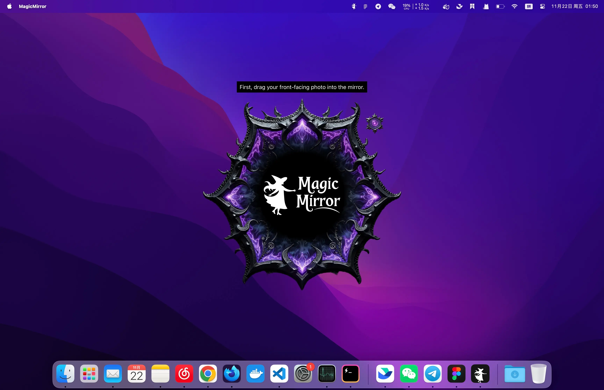
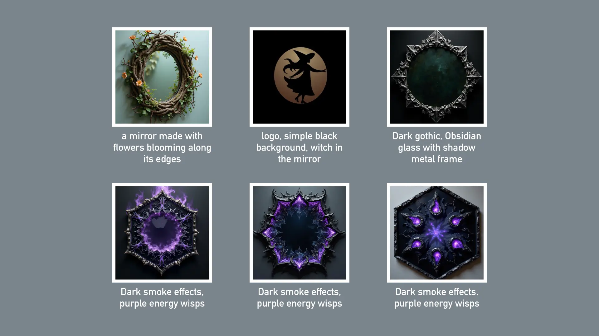
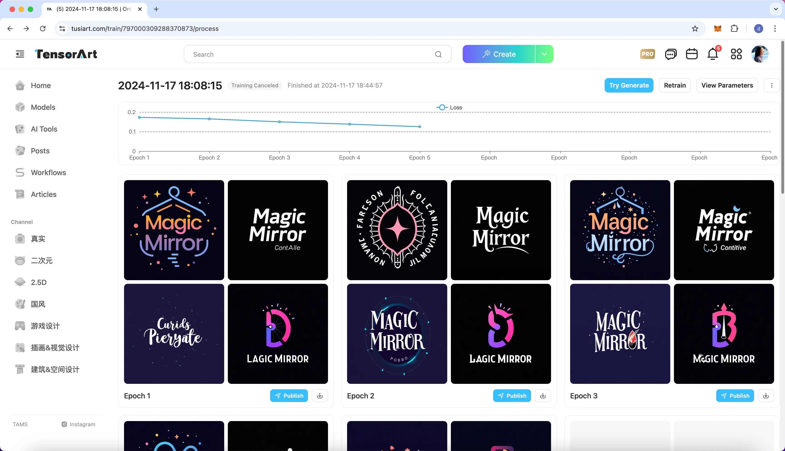

# MagicMirror

一键 AI 换脸、发型、穿搭，发现更美的自己 ✨

  

## 功能亮点

- 一键换脸：打开安装包，拖张照片进去就能换脸，无需配置各种复杂参数。
- 超低门槛：不用 GPU 也能运行，普通的小白电脑也可以轻松玩转 AI 换脸。
- 隐私安全：完全在你的电脑本地运行，不需要联网，不用担心你的图片会被上传到任何地方。
- 极致精简：安装包不到 10 MB，模型文件加起来不到 1 GB，这可能是最轻量的离线换脸应用之一。

## 快速开始

MagicMirror 目前支持 macOS 和 Windows 系统：

1. [下载安装包](https://github.com/idootop/MagicMirror/releases/tag/app-v1.0.0)
2. [使用教程](https://ccnpyvkdfkte.feishu.cn/wiki/LAn6w4NqwiqeKmkXBrLc4MEBnDh)

如果你还有其他问题，请提交 [Issue](https://github.com/idootop/MagicMirror/issues) 或加入 [QQ 交流群](https://pd.qq.com/s/btxvzr9de)。

## 动机

我想你跟我一样，有时会纠结：自己适合哪种发型，或者哪种穿搭最好看？

要是有一个应用，可以把我们看到的喜欢的发型或心动的穿搭，直接放到自己的身上预览效果，那真是太好了。

现在的 AI 技术已经很成熟了，但是市面上大部分的 AI 换脸应用：

- 要么需要配置复杂的参数和运行环境，要有性能足够强劲的 GPU 才能运行，使用门槛和成本偏高；
- 要么需要上传自己的图片到服务器进行转换，存在隐私泄漏的风险。

理想的解决方案应该像自拍一样简单：不需要设置复杂的参数，不用购买昂贵的设备，也无需担心隐私泄漏的问题。

所以，为什么不自己做一个呢？

于是便有了 MagicMirror ✨

Enjoy! ;)

## One More Thing

如你所见，MagicMirror 内的所有设计资源：从 Logo、字体到 UI 界面，都是由 AI 生成的 ✨

这里我使用的是 [Tensor.ART](https://tusiart.com/)：一个免费的在线 AI 生图网站。像最新的 Flux 和 SD 3.5 等模型都可以直接使用，而且你也可以在线训练自己的模型。比如 MagicMirror 的 LOGO， 就是我从 Dribbble 上搜集了一些参考图，然后用 Flux 做底模训练的一个模型生成的，非常方便。

相比 [Civitai](https://civitai.com/) 和 [LibLib.AI](https://www.liblib.art/) 等 AI 生图平台，[Tensor.ART](https://tusiart.com/) 的模型数量更多，价格更便宜，性价比应该是这三者里最高的。如果你也想要尝试 AI 生图，或者正在寻找更有性价比的生图平台，不妨试试看 [Tensor.ART](https://tusiart.com/)。

## 鸣谢

MagicMirror 的实现主要使用和参考了以下开源项目，特此鸣谢:

- [Tauri](https://github.com/tauri-apps/tauri): Build smaller, faster, and more secure desktop and mobile applications with a web frontend.
- [FaceFusion](https://github.com/facefusion/facefusion): Industry leading face manipulation platform
- [InsightFace](https://github.com/deepinsight/insightface): State-of-the-art 2D and 3D Face Analysis Project
- [Nuitka](https://github.com/Nuitka/Nuitka): Nuitka is a Python compiler written in Python.

## 免责声明

MagicMirror 仅限个人娱乐与创意用途，严禁用于商业用途。请注意：

- **道德使用**：本软件不得用于以下行为，包括但不限于：a) 恶意冒充他人，b) 散布虚假信息，c) 侵犯个人隐私或尊严，d) 制作淫秽或不当内容。
- **内容版权**：用户应对以下内容负责：a) 获取使用源图像的必要许可，b) 尊重版权及知识产权，c) 遵守当地关于 AI 生成内容的法律法规。
- **免责声明**：用户应对生成的内容以及由其使用引发的任何法律、道德或个人问题承担全部责任。本软件及其开发者对用户生成的内容不承担任何责任。

使用 MagicMirror 即表示您已阅读并同意上述条款，并承诺负责任地使用本软件。

## License

This project is licensed under the [MIT License](./LICENSE).
