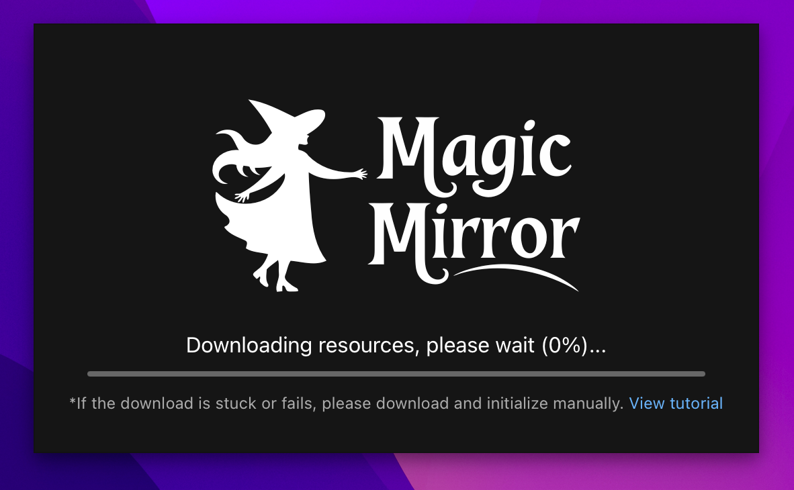

# 安装教程

## 下载地址

首先根据你的操作系统，下载对应的 APP 安装包并安装：

1. Windows: [MagicMirror_1.0.0_windows_x86_64.exe](https://github.com/idootop/MagicMirror/releases/download/app-v1.0.0/MagicMirror_1.0.0_windows_x86_64.exe)
2. macOS: [MagicMirror_1.0.0_macos_universal.dmg](https://github.com/idootop/MagicMirror/releases/download/app-v1.0.0/MagicMirror_1.0.0_macos_universal.dmg)

> 如果你访问不了上面的 GitHub 下载链接，请使用国内[下载地址](https://del-wang.lanzout.com/b01qdt5nba) 密码: `4ro2`

## 下载模型

首次启动 APP，需要下载模型文件（默认会自动下载），初始化成功后才能使用。

如果你的下载进度一直是 0，或者下到一半卡住了，请按照下面的步骤手动初始化：

**下载模型文件**

首先根据你的操作系统和架构，选择对应的模型文件：

- [server_windows_x86_64.zip](https://github.com/idootop/MagicMirror/releases/download/server-v1.0.0/server_windows_x86_64.zip)（Windows，大多数的电脑都是这种）
- [server_windows_aarch64.zip](https://github.com/idootop/MagicMirror/releases/download/server-v1.0.0/server_windows_aarch64.zip)（Windows，如果你是 ARM64 设备）
- [server_macos_aarch64.zip](https://github.com/idootop/MagicMirror/releases/download/server-v1.0.0/server_macos_aarch64.zip)（macOS, 苹果芯片，比如 M1、M4 芯片）
- [server_macos_x86_64.zip](https://github.com/idootop/MagicMirror/releases/download/server-v1.0.0/server_macos_x86_64.zip)（macOS, Intel 芯片）

> 如果你访问不了上面的 GitHub 下载链接，可以使用国内的[下载地址](https://pan.quark.cn/s/b8ad043794bb)

**解压下载的文件**

解压后应该是一个文件夹，把它重命名成: `MagicMirror` 然后移动到你电脑的 `HOME` 目录下，比如：

完成上面两步后，重启 MagicMirror 应该就能正常启动了。

## 启动 APP

下载完模型文件后，第一次启动应用可能比较缓慢，耐心等待即可。

> 一般 3 分钟以内即可启动成功，如果超过 10 分钟还未正常启动，请查看[常见问题](./faq.md)

## 遇到问题？

大部分问题都能在「[常见问题](./faq.md)」里找到答案，如果你还有其他问题，请在此[提交反馈](https://github.com/idootop/MagicMirror/issues)。
