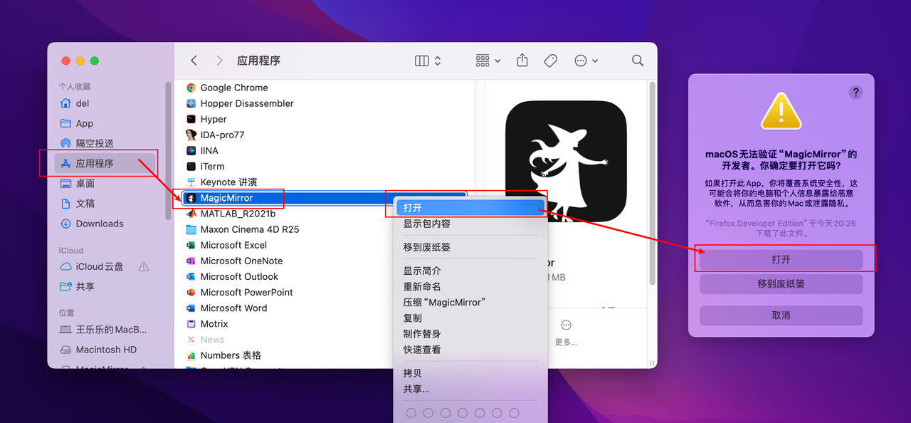

# FAQ

## Common

### How to Enable GPU Acceleration for Inference?

MagicMirror uses CPU by default for inference and currently does not support hardware acceleration options. However, you can try MagicMirror’s CLI version, [TinyFace](https://github.com/idootop/TinyFace), or use [FaceFusion](https://github.com/facefusion/facefusion).

### Why is MagicMirror So Small in Size?

This is thanks to [Tauri](https://tauri.app/), which uses the system’s built-in WebView component, unlike [Electron](https://www.electronjs.org/), which packages an entire Chromium browser and Node.js runtime into the app. If you're interested in the technical details, [click here](https://tauri.app/start/).

### Is the MagicMirror Logo AI-Generated?

Every design element in MagicMirror - from the logo and typography to the UI - was created using AI ✨

I used [Tensor.ART](https://tensor.art/), a free AI image generation platform. It offers access to the latest models like Flux and SD 3.5, plus the ability to train your own custom models. 

For example, I created MagicMirror's logo by training a Flux-based model on reference images collected from Dribbble - quick and simple.

Compared to platforms like [Civitai](https://civitai.com/) and [LibLib.AI](https://www.liblib.art/), [Tensor.ART](https://tensor.art/) has more models at a lower price, making it the most cost-effective option. 

If you're looking to try AI image generation or want a more affordable platform, I recommend giving [Tensor.ART](https://tensor.art/) a try.

## Installation

### 【macOS】App is Damaged or Can't Be Verified

This issue occurs because the app isn't signed with an Apple developer certificate. To resolve this:

1. Open Finder and select Applications from the sidebar.
2. Locate the app with the warning, right-click it, and choose Open.

## Usage

### 【Windows】App Stuck on the Startup Screen for Over 10 Minutes

If the app is stuck at the startup screen, check if the `server.exe` file exists on your system. This file, compiled using [Nuitka](https://github.com/Nuitka/Nuitka) from Python source, is essential for MagicMirror to run.

Windows Defender may flag the `server.exe` as malicious due to the use of Nuitka by some malware, leading to it being quarantined.

To fix this:

1. Open Windows Security Center and go to Protection History.
2. Find and restore the quarantined `server.exe`.
3. Restart MagicMirror.

> For details on Nuitka false positives in Windows Defender, [click here](https://github.com/Nuitka/Nuitka/issues/2685#issuecomment-1923357489).

### 【Windows】Face Swap Fails with Any Image

First, check if the `server.exe` file exists in `$HOME/MagicMirror/`. If it’s missing, follow the steps in the previous section to restore it.

If the issue persists, please [submit an issue](https://github.com/idootop/MagicMirror/issues).

### 【Windows】"Not a Valid Win32 Application" Error

MagicMirror currently only supports x64 and ARM64 architectures. Older x32 systems are not supported.

The recommended environment is Windows 11 x64. MagicMirror may not run properly on versions lower than Windows 10.

### 【macOS】App Stuck on Startup for Over 10 Minutes

First-time startup on macOS can be slow. If the app doesn’t start within 30 minutes, close it and try again.

If it still doesn’t launch, ensure your macOS version is at least `10.13`, as older versions may not be compatible.

## Other

### What’s the Relationship Between MagicMirror and FaceFusion?

In simple terms, MagicMirror is a simplified version of FaceFusion.

Starting from [FaceFusion](https://github.com/facefusion/facefusion), I removed unnecessary modules and kept only the core face-swapping functionality, which led to the creation of [TinyFace](https://github.com/idootop/TinyFace), a lightweight Python face-swapping tool.

MagicMirror is a GUI project built on top of [TinyFace](https://github.com/idootop/TinyFace), making it easier to use.

### What’s the Relationship Between MagicMirror and InsightFace?

A typical face-swapping workflow includes multiple steps, such as face detection, recognition, swapping, and quality enhancement. These steps rely on different models. The `inswapper_128.onnx` model from [InsightFace](https://github.com/deepinsight/insightface/tree/master/examples/in_swapper) is a core part of the face-swapping process.
