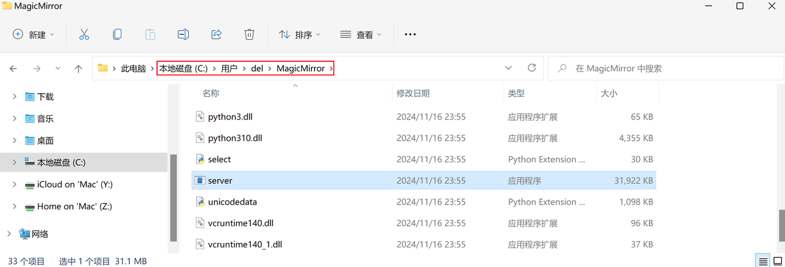
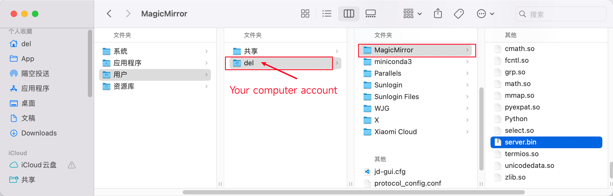

# Installation Guide

## Installation

Download and install the MagicMirror installer for your operating system:

1. Windows: [MagicMirror_1.0.0_windows_x86_64.exe](https://github.com/idootop/MagicMirror/releases/download/app-v1.0.0/MagicMirror_1.0.0_windows_x86_64.exe)
2. macOS: [MagicMirror_1.0.0_macos_universal.dmg](https://github.com/idootop/MagicMirror/releases/download/app-v1.0.0/MagicMirror_1.0.0_macos_universal.dmg)
3. Other: [Go to Release](https://github.com/idootop/MagicMirror/releases/app-v1.0.0)

## Download Models

When you first launch the app, it will automatically download the required model files.

If the download progress is stuck at 0% or stops midway, follow these steps for manual setup:

**Download Model Files**

Choose the model file that matches your operating system:

- [server_windows_x86_64.zip](https://github.com/idootop/MagicMirror/releases/download/server-v1.0.0/server_windows_x86_64.zip)（Windows, most common）
- [server_windows_aarch64.zip](https://github.com/idootop/MagicMirror/releases/download/server-v1.0.0/server_windows_aarch64.zip)（Windows, for ARM64 devices）
- [server_macos_aarch64.zip](https://github.com/idootop/MagicMirror/releases/download/server-v1.0.0/server_macos_aarch64.zip)（macOS, Apple Silicon, such as M1, M4 chips）
- [server_macos_x86_64.zip](https://github.com/idootop/MagicMirror/releases/download/server-v1.0.0/server_macos_x86_64.zip)（macOS, Intel chips）

**Extract the Downloaded File**

You'll get a folder—rename it to `MagicMirror`. Move this folder to your computer's `HOME` directory, for example:

Restart MagicMirror, and it should now work properly.

## Launch APP

After downloading the model files, the first launch may take some time.

> The app should launch within 3 minutes. If it takes longer than 10 minutes to start, please refer to the [FAQ](./faq.md)

## Need help?

Most issues are addressed in the [FAQ](./faq.md). If you need further assistance, please [submit an issue](https://github.com/idootop/MagicMirror/issues).
